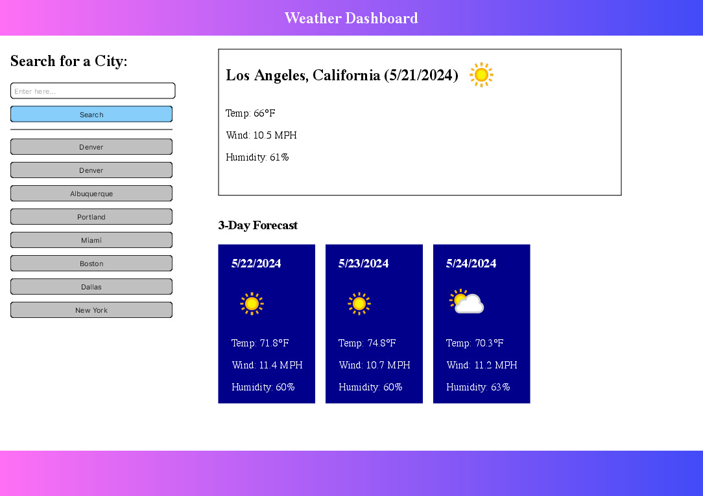

# SkyWatcher
SkyWatcher gives users live updates on weather conditions based on location. Users are provided with the current location's temperature, wind speeds, and humidity percentage. Weather Dashboard also gives users a three day forecast of weather conditions.

The live version of this project can be accessed at: https://ojds2022.github.io/weather_dashboard/

